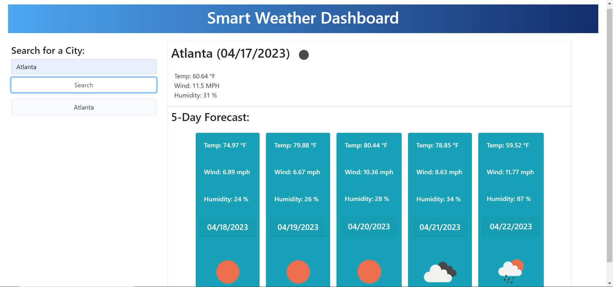

# 06 Server-Side APIs: Weather Dashboard

https://tylerjohnsonhockey.github.io/Smart-Weather-Dash/

Challenge 6 was about creating a weather dashboard to display various weather data based on a specified location. The user can search and save cities in local data. When a city is selected APIs from Open Weather are called to display the current weather above boxes showing the 5-day outlook.

## Screenshot

